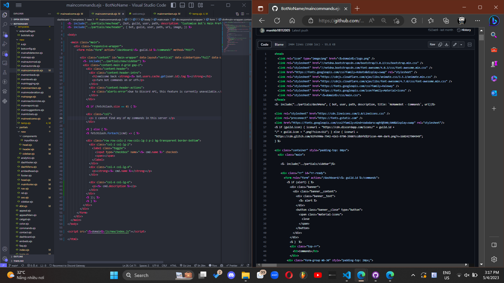
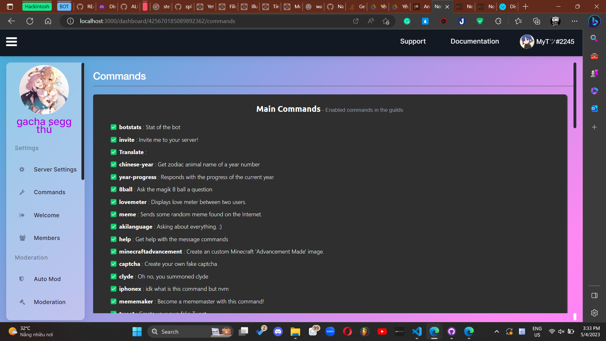
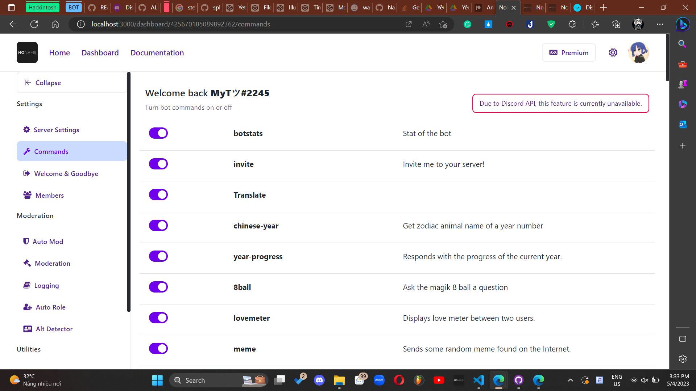

Hi there, it has been a very long time since my latest update. Although I regularly pushed new updates to Github, I was so lazy to write a short blog post about it. I will try to be more active in the future.

So in the past few months, I have been struggling with exams, exams and exams... ~~genshin is great thru~~ I spent time on coding mainly on weekend or holiday, and it was all about the website. The old code I borrowed from Github is totally a mess (I have no idea why he copied the same style for 10 pages literally), therefore reusing the old code is not a great idea. I need to write a new codebase totally from scratch, which you all know costs a lot of time. I have to admit that I am not a good front-end developer, so I spent a lot of time on learning and trying new things. I am still learning, and I will keep learning. ==lol copilot wrote the last sentence==. Between React and Bootstrap, React is better for big production, greater performance, but it takes double the time 😭. 

So basically I started taking drafts on my IPAD, then I chose the most compatitable and **easiest** to start working on. By dividing into small components, I can reuse the code very effectively. Besides, I decided to transfer the current subdomain and use a new web homepage from React. I am still working on it, and I will try to finish it as soon as possible.

In the above image, you can see that on the same page, the old code has 2404 lines, meanwhile the new one has only 58. The most obvious advantage is that you can understand the code clearly and my server will spend less time compiling.

Also you can easily compare the new layout with the former. While it depends on personal tastes, I believe the new one is more modernized and cleaner.

So that all for this blog, I will need several weeks to migrate the current features to new UI, and also time for testing, so stay tuned!!!
