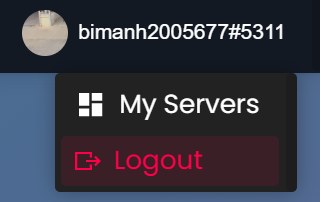
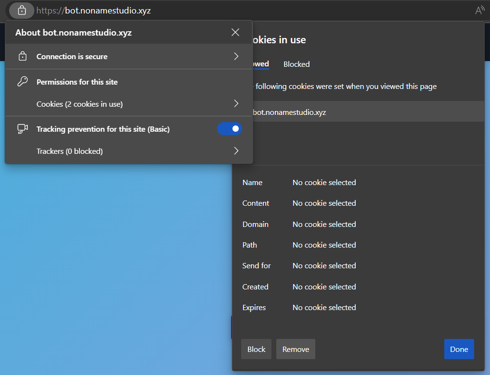

Logging out of dashboard is simple, but sometimes you can be logged in to an incorrect account either because of Discord, or you forgot to log out of that testing account in your browser. (We've all been there).

When logging out, first log out from the dashboard by clicking on your profile in the top right, then select "Logout".

After you log out from the dashboard, you'll need to navigate to the Discord website in your browser, and log out from there too.

:::caution
Make sure you are 100% logging out from Discord in your browser, and not the downloaded application, this makes a huge difference.
:::

If following the above fails to work, try clearing your cookies for both the dashboard and Discord website.
You can clear the cookies by going into your browsing history and clearing them all from there, or by clicking the lock icon in the URL bar:

After selecting the "Cookies" option, select `b.nnsvn.me` from the list and remove those cookies, do the same for `discordapp.com` when you reach the Discord website.

:::tip
You can also try using an incognito tab by pressing CTRL+SHIFT+N simultaneously or selecting the option in the top right of your browser in the options menu. This will give you a temporary clean browsing tab where there are no saved passwords, and you aren't logged in by default anywhere.
:::

If you are still having issues logging out, feel free to join our [support server](https://bot.nnsvn.me/discord) for more instructions.