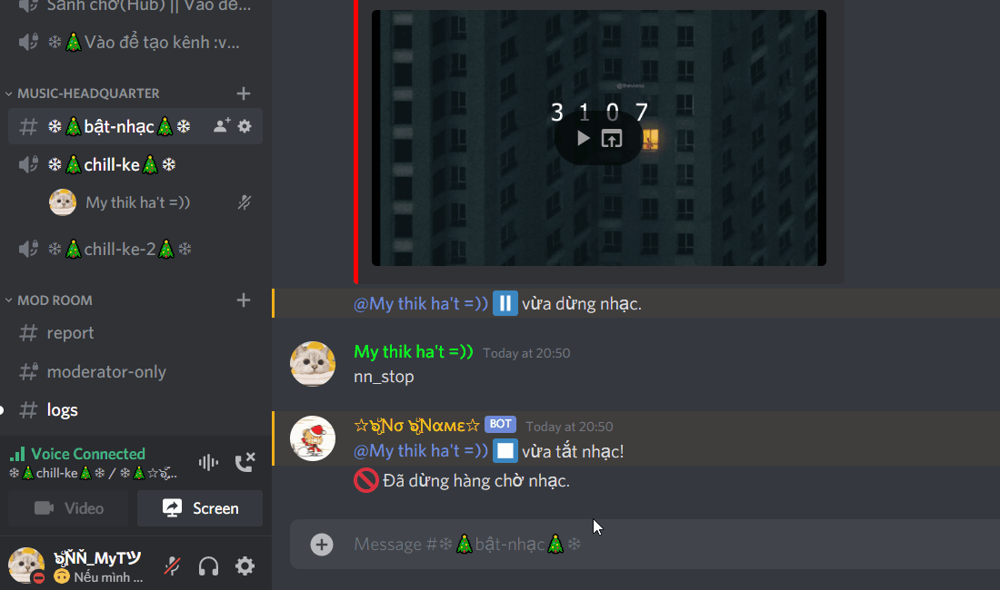
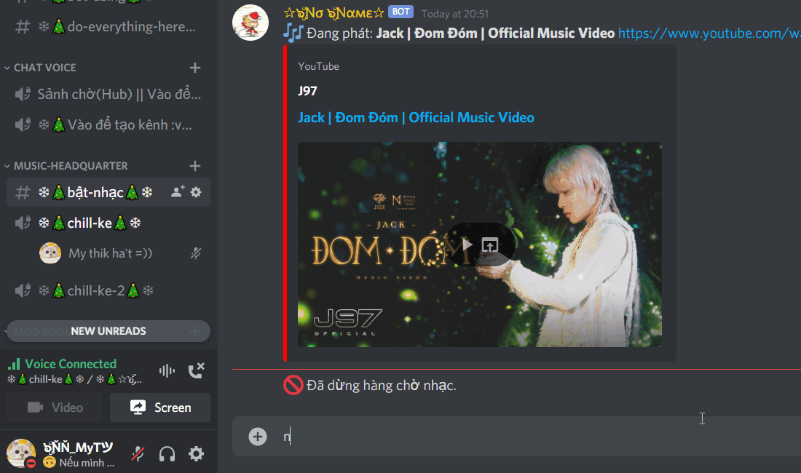
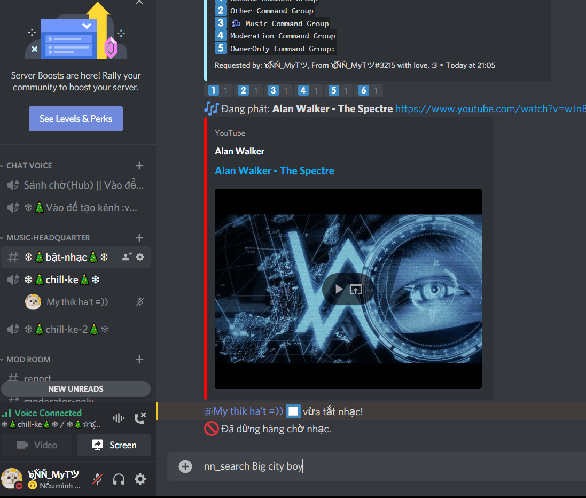

We offers you a much more simply feature-rich command list than the average music bot! Listening to music in Discord has never been so easy before!

---
:::tip Below is a list of general commands. We used  nn_ for the prefix since it's the default.

**`() means optional`**
**`<> means required`**
:::


- **`nn_join`** ```<someone> (someone)```: join a channel
- **`nn_leavle`**: leave a channel
- **`nn_play`** ``` <Name || URL> ```: Plays a song. Aliases: nn_p  

<div style={{textAlign: 'center'}}>

  

</div>  

- **`nn_playlist`** ``` <Name || URL>```: Play a playlist from Youtube.  Aliases: nn_pl  

<div style={{textAlign: 'center'}}>

  

</div>  

- **`nn_search`** ``` <Name>```: Search for a video on Youtube.  

<div style={{textAlign: 'center'}}>

  

</div>

- **`nn_stop`**: Stop playing musics.
- **`nn_lyrics`**: Find lyrics of one songs.
- **`nn_queue`**: Know how many songs are on your queue.
- **`nn_nowplaying`**: Take a look of the songs being played. Aliases: nn_np
- **`nn_remove`** ``` (number-of-song)```: Remove a specific song from the queue.
- **`nn_pause`**: Pauses the current playing song.
- **`nn_resume`**: Resumes the current paused song.
- **`nn_skip`** ``` (tracknumber)```: Skip the current song.
- **`nn_skipto`** ``` <tracknumber>```: Skips to a specific track in the queue.
- **`nn_loop`**: Loop the queue.
- **`nn_shuffle`**: Shuffle the queue.
- **`nn_volume`** ``` <1-100>```: Change the volume of bot.